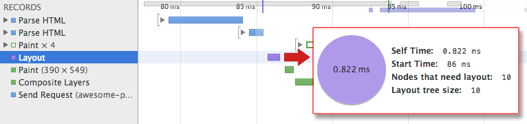

# 렌더링 트리 및 렌더링 프로세스

> 렌더링은 렌더 트리 생성 → 레이아웃 → 페인트 의 순서로 이루어진다.
> 

## TL; DR

1. HTML 마크업을 처리하여 DOM 을 만든다
2. CSS 마크업을 처리하여 CSSOM 을 만든다
3. DOM 과 CSSOM 을 결합하여 렌더 트리를 만든다
4. 렌더링 트리에서 레이아웃을 실행하여 뷰 포트에 표현될 각 노드의 기하학적 형태를 계산한다.
5. 각 노드를 화면에 페인트한다.

## 렌더링 트리란?

렌더링 트리는 DOM 트리와 CSSOM 트리가 결합되어 만들어진다.

렌더링 트리의 사용 목적: 렌더링 트리는 각 요소의 레이아웃을 계산하는데 사용되고, 픽셀을 화면에 렌더링하는 페인트 프로세스의 입력으로 사용된다. 

따라서 렌더링은 렌더링 트리 생성 → 레이아웃 → 페인팅 세 단계로 이루어지며, 최적의 렌더링 성능을 얻기 위해서는 각각의 단계에서 최적화가 이루어져야 한다.

## 1. 렌더링 트리 생성

렌더링 트리를 생성하기 위해서는 (당연한 말이지만) DOM 트리와 CSSOM 트리가 필요하다. 

브라우저는 렌더링 트리를 만들기 위해 대략적으로 다음 작업을 수행한다.

1. DOM 트리의 루트부터 시작하여 표시되는 노드들을 각각 트래버스한다.
    1. 루트는 html이 된다. head에 있는 스크립트 태그, 메타 태그등은 렌더링되지 않으므로 생략된다.
    2. CSS를 통해 숨겨지는 노드들(ex: `display: none;`)도 렌더링에서 제외된다.
2. 표시된(트래버스된) 각 노드들에 대해 적절하게 일치하는 CSSOM 규칙을 찾아 적용한다.
3. 표시된 노드(렌더링 트리)를 콘텐츠 및 계산된 스타일과 함께 내보낸다.

최종 출력은 화면에 표시되는 모든 노드의 콘텐츠 및 스타일 정보를 포함하는 렌더링 트리이다.

렌더링 트리가 생성되었으므로 이제 '레이아웃' 단계로 진행할 수 있다.

- ⚠️ `visibility: hidden;`  과 `display: none;` 의 차이
    
    전자: 요소는 보이지 않으나 해당 스타일이 적용된 요소는 여전히 레이아웃에서 공간을 차지한다. (즉, 비어있는 상자로 렌더링된다)
    
    후자: 요소는 보이지 않으며, 레이아웃에 포함되지 않도록 렌더링 트리에서 완전히 제거된다.
    

## 2. 레이아웃

렌더링 트리를 생성하면서 해당 노드의 계산된 스타일을 계산했다.(말이 조금 이상하지만, 각 노드가 가지는 여러 계산값들이 정리되어, 각 항목이 최종적인 하나의 값을 가지도록 정리된 상태라고 이해하자)

하지만 기기의 '뷰 포트' 내에서 노드들의 정확한 위치와 크기를 계산하지는 않았다. 노드가 실질적으로 뷰포트에서 표시될 위치와 크기를 정하는 일을 **레이아웃** 이라고 하며 상황에 따라서는 **리플로우** 라고도 한다.

페이지에서 각 객체의 정확한 크기와 위치를 파악하기 위해 브라우저는 렌더링 트리의 루트에서 시작하여 렌더링 트리를 트래버스한다.

레이아웃 프로세스에서는 뷰포트 내에서 각 요소의 위치와 크기를 정확하게 캡쳐하는 '상자 모델(Box Model)'이 출력된다. 모든 상대적인 출력값은 절대값인 픽셀로 변환된다.

ex: `
content
` 인 렌더링 트리의 노드는 width: 50%라는 값을 실제 뷰포트의 width의 절반값(또는 부모 노드의 width의 절반값)을 구해서 숫자 리터럴을 대입한다.

이제 표시되는 노드와 노드들의 계산된 스타일 및 기하학적 형태에 대해 파악했다. 이러한 정보를 렌더링 트리의 각 노드를 화면에 픽셀로 표시하는 단계로 보낼 수 있다. 

## 3. 페인팅

레이아웃을 통해 렌더링 트리의 각 노드가 실질적으로 차지하는 값을 계산하고 노드들의 기하학적 형태를 구했다. 이를 화면에 그려서 사용자에게 표시하는 작업을 **페인팅** 또는 **래스터화** 라고 부른다.

레이아웃이 완료되면 브라우저는 Paint Setup 및 Paint 이벤트를 발생시킨다. 이 작업은 렌더링 트리를 화면의 픽셀로 변환한다.

페인팅에는 브라우저가 처리해야 할 작업들이 상당히 많으므로 시간이 걸릴 수 있다. 또한 DOM 또는 CSSOM이 수정된 경우 1 ~ 3 번 프로세스를 반복해야 한다.

Chrome Dev Tools 을 사용하면 위의 1, 2, 3번 프로세스에 관련된 정보를 제공해 준다. 

정리하자면 브라우저 또는 렌더링엔진에서 일어나는 렌더링 프로세스는 다음과 같다.

1. DOM 마크업을 읽어서 DOM 트리를 생성
2. CSS 마크업을 읽어서 CSSOM 트리를 생성
3. DOM, CSSOM 트리를 가지고 렌더링 트리를 생성
4. 생성된 렌더링 트리를 가지고 레이아웃을 통해 각 노드의 크기와 위치를 계산
5. 레이아웃이 끝난 렌더링 트리를 가지고 화면에 페인팅

👍 주요 렌더링 경로를 최적화하는 작업이란, 위에 설명된 1 ~ 5 단계를 수행하는데 걸리는 총 시간을 최소화하는 프로세스 이다.

 

⭐️ 최적화를 통해 **콘텐츠를 빠르게 화면에 렌더링할 수 있으며**, **초기 렌더링 후 화면 업데이트에 걸리는 시간을 줄여주고**, **대화형 콘텐츠(채팅 등)의 새로고침 속도**를 높일 수 있다.