# 도커로 젠킨스 설치 및 깃랩과 연동

## 젠킨스 설치

먼저 젠킨스 이미지를 내려받는다

```bash
$ sudo docker pull jenkins/jenkins:lts
```

그 후 젠킨스 이미지를 실행한다(컨테이너화)

```bash
$ docker run -d -p 8181:8080 -v /jenkins:/var/jenkins_home --name my_jenkins -u root jenkins/jenkins:lts
```

각 옵션의 뜻은 

- -d : 해당 컨테이너를 백그라운드에서 실행한다
- -p : 외부에서 접근할 포트: 접근시 연결되는 내부포트 를 지정(포워딩)해준다.
- -v: 호스트와 컨테이너의 디렉토리를 연결(마운트) 한다.
- —name: 실행될 컨테이너의 이름을 지정해준다
- -u: 실행할 사용자를 지정한다
- 맨 마지막의 jenkins/jenkins:lts 는 실행할 이미지의 이름이며 해당 이름의 이미지 파일이 없을 경우 도커허브에서 찾아서 땡겨오려고 시도하므로 주의하자⚠️

 

실행된 컨테이너를 다음 명령어로 볼 수 있다.

```bash
$ docker ps
```

이제 `http://사이트주소:8181`로 들어가서 젠킨스를 켜 보자. 아마 키를 입력 하라고 나올 것이다.

여기서 두가지 방법이 있는데 첫번째는 우리가 마운트한 폴더를 들어가는 것이다.  `-v` 옵션을 통해 현재 루트에 있는 jenkins라는 폴더가 컨테이너의 `/var/jenkins_home` 이라는 폴더와 연동된 상태이다. 그러므로 마운트 된 폴더에 들어가거나 실행되어 돌아가고 있는 젠킨스 컨테이너에 직접 들어가서 확인하는 방법 두가지가 있다.

1. 마운트된 폴더에 들어가서 확인하기
    
    ```bash
    cd /jenkins/secretes
    cat initialAdminPassword
    ```
    
2. 젠킨스 컨테이너 안으로 들어가서 확인하기
    
    ```bash
    sudo docker exec -it my_jenkins /bin/bash
    cd /var/jenkins_home
    cat initialAdminPassword
    ```
    

찾은 키를 입력해주면 플러그인 설치 화면이 나온다. 웬만하면 Install suggested plugins 를 눌러서 젠킨스가 추천하는 플러그인들을 설치해주자. 시간이 조금 걸린다.

유저설정까지 해주면 다음과 같이 젠킨스가 나온다.

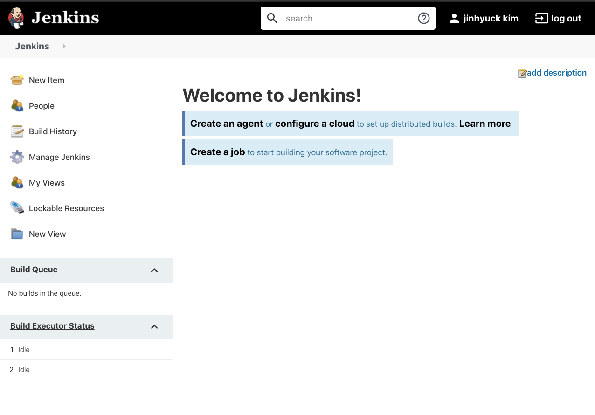

## 젠킨스와 깃랩 연동하기

아직은 젠킨스 기본 플러그인만 설치된 상태이다. 여기에 두가지 플러그인을 더 추가해야 깃랩과의 연동이 가능하다. 

- gitlab
- publish over SSH

플러그인 설치는 Manage jenkins → manage plugins 에서 가능하다

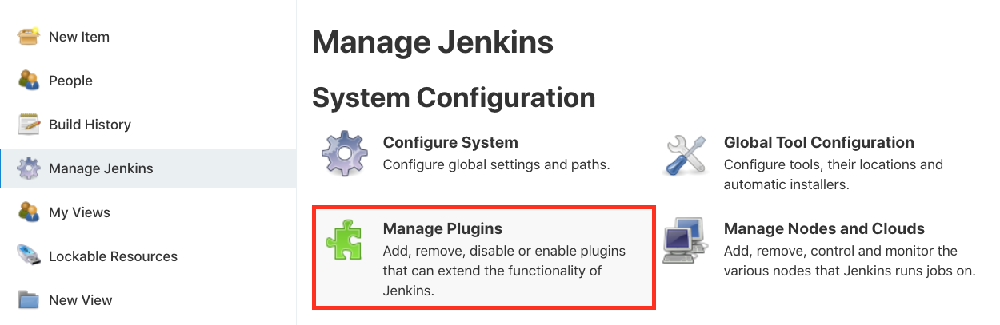

available plugins 탭으로 이동하여 검색 후 설치할 수 있다. 해당 칸을 누르는 것이 아닌 체크박스에 체크를 하고 밑에 있는 install 버튼을 눌러야 하니 헷갈리지 말자.

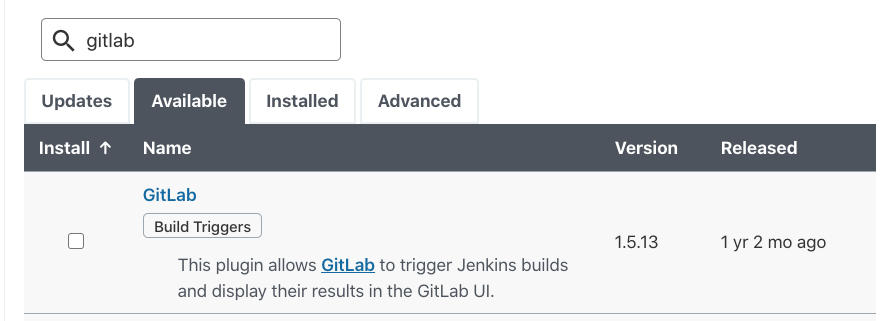

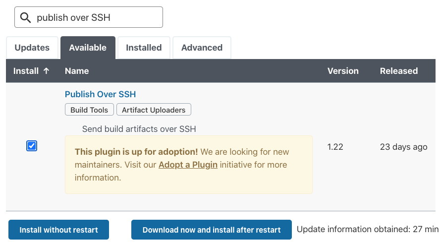

이제 젠킨스 내에서 작업을 위한 item을 생성해야 한다. 메인 페이지에서 New item을 선택하고 적당히 아이템 이름을 지어준 뒤 Freestyle Project를 선택한 뒤 맨 밑에 있는 OK 를 누르자.

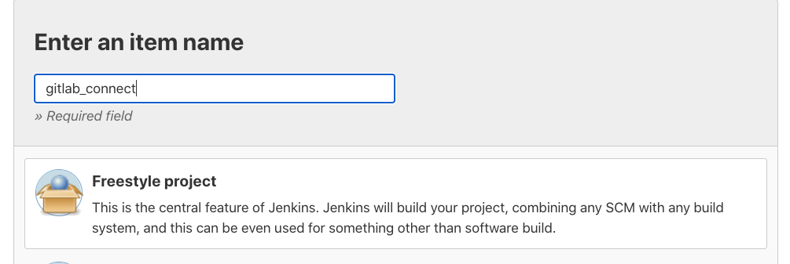

깃랩에서 젠킨스에 트리거를 전송하려면 젠킨스에서 제공하는 secret token이 필요하다. Build triggers 항목의 'Build when a change is pushed to Gitlab. URL: 블라블라' 를 체크하고 밑에 있는 Advanced 를 눌러 상세 설정에 들어가자. 현재 가려놓은 부분은 이 젠킨스 아이템의 URL인데 나중에 깃랩에서 연동할 때 저 주소도 같이 입력해야 한다. 기억해두자.

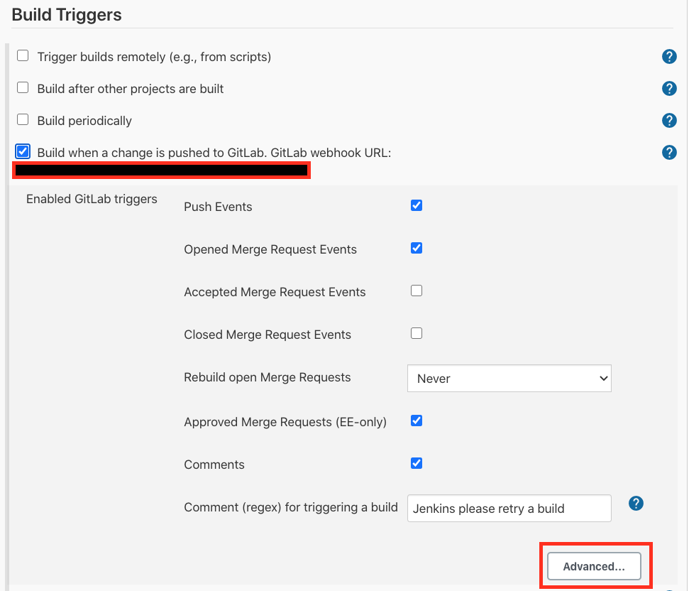

확장된 탭을 보면 secret token 이라는 항목이 있다. Generate를 눌러 토큰을 생성하자.

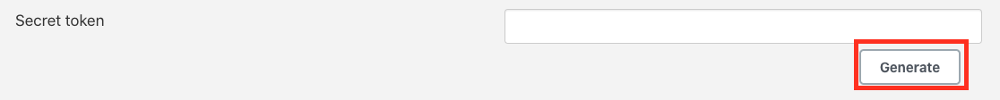

토큰을 복사해서 잘 저장한 뒤 반드시 ⚠️왼쪽 하단에 있는SAVE 버튼을 눌러야 깃랩 트리거 설정이 완료된다!!

이제 젠킨스에서 만든 토큰을 넣어주러 깃랩으로 이동하자. 깃랩에서 연동하고자 하는 저장소로 이동한뒤 settings > integration 항목으로 이동한다.

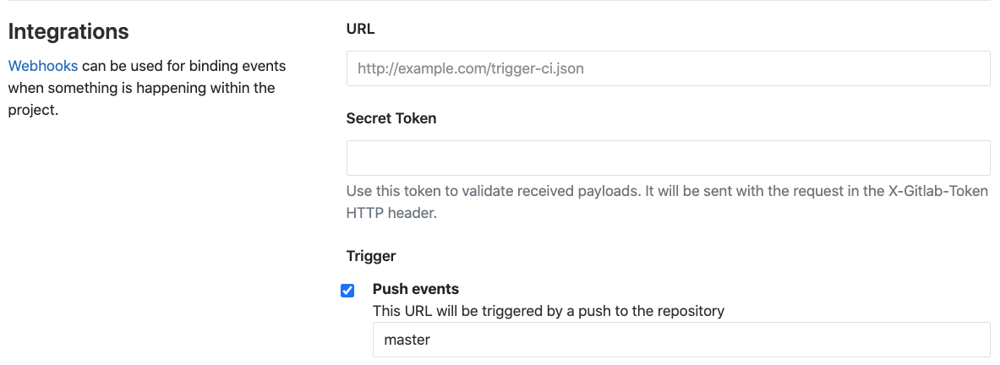

URL에는 아까 위에서 기억하라고 했던 우리의 아이템 URL 그리고 토큰값을 넣어주면 된다. Push events에는 적용할 브랜치를 적어주면 되는데 빈 값으로 두게 되면 모든 브랜치에 적용된다. 한 마디로 모든 브랜치에서 푸시 이벤트가 일어날 때 마다 젠킨스가 트리거 된다는 뜻이니 웬만하면  master 하나만 적어서 불필요한 푸시 이벤트를 발생시키지 않는 것이 좋다.

다 되었다면 조금 내리다 보면 있는 Add webhook 버튼을 눌러 추가하자.

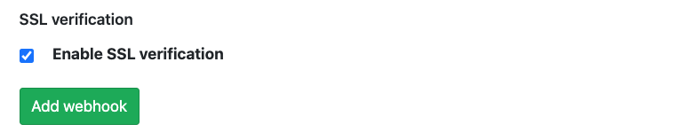

추가했다면 Add webhook 버튼 밑에 생성된 웹훅이 보인다. 테스트를 위해 푸시 이벤트를 발생시켜 보자.

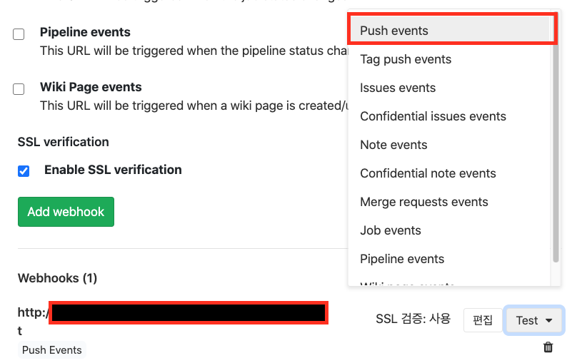

성공했다면 다음과 같은 메시지를 볼 수 있다.

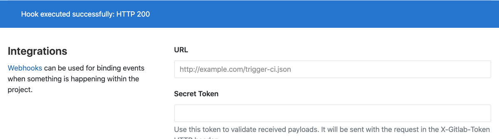

## 푸시 이벤트를 통해 가져온 코드를 빌드 및 배포

생성된 아이템의 소스 코드 관리 탭으로 이동해야 한다. 젠킨스의 메인 화면에서 해당 아이템의 configure를 클릭하자

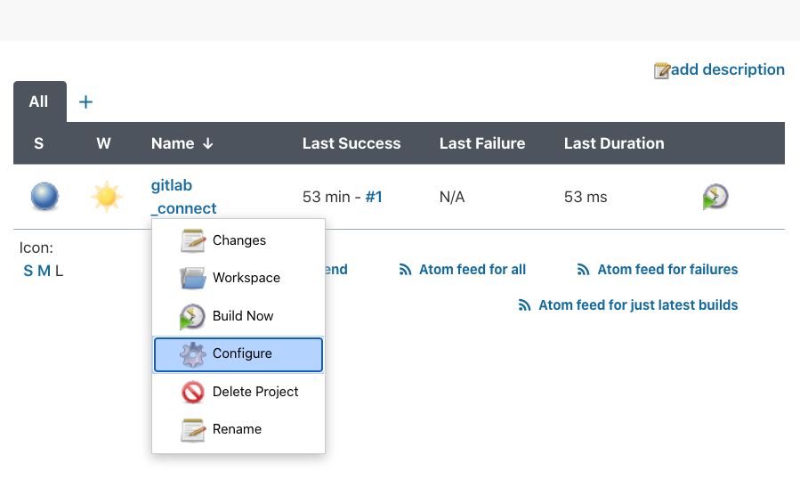

소스코드 관리 도구로 Git을 선택하면 다음과 같이 탭이 생긴다. Repository URL 에는 git clone에 사용되는 레포지토리의 주소를 넣는다. 깃랩의 해당 레포지토리에서 손쉽게 복사해 올 수 있다. Credentials에는 아직 설정된 게 없기 때문에 Add 를 클릭한다.

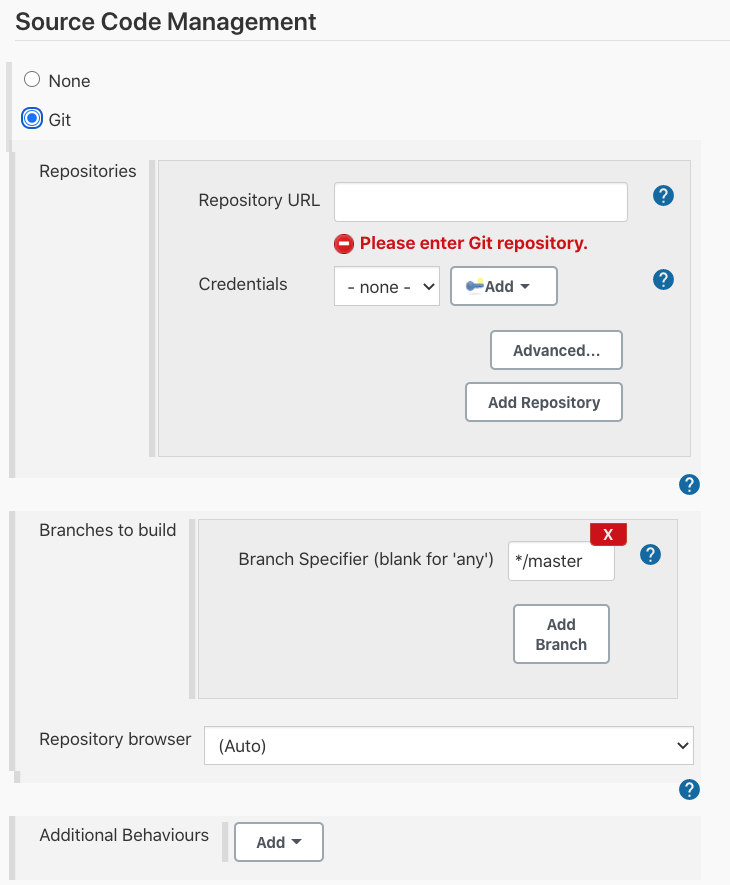

kind는 username with password로 둔다. username에 깃랩 로그인 시 사용되는 이메일 주소, password에 깃랩 패스워드를 입력하고 Add를 눌러 나의 정보를 저장한뒤 Credentials에서 선택하면 된다.

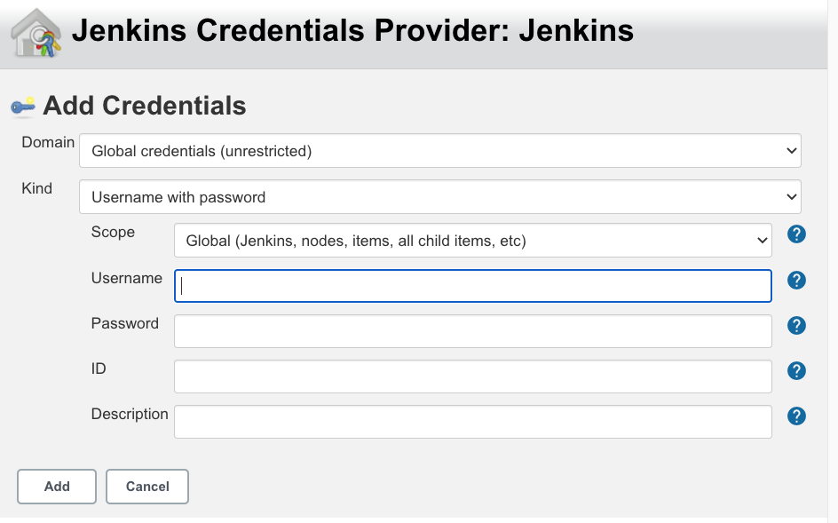

하단의 Apply 버튼을 눌러 설정을 저장한 뒤 Build 탭으로 이동하자.

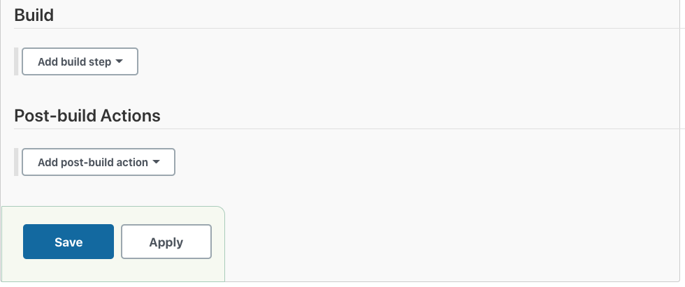

Execute shell을 누르자

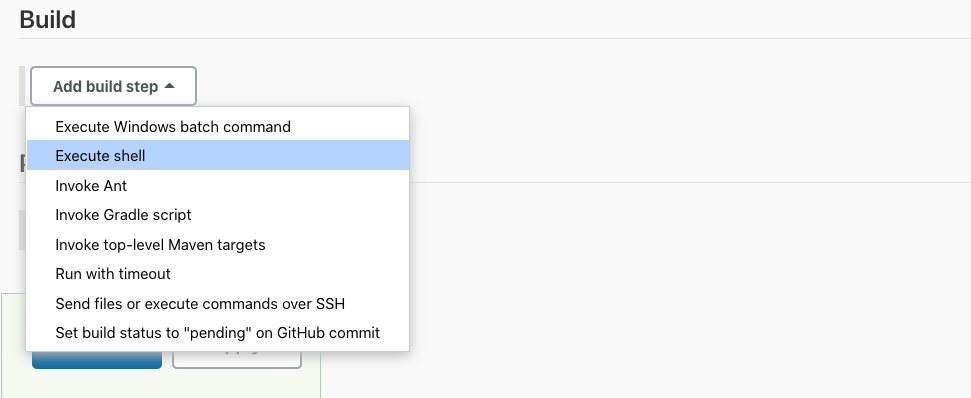

우선 실행되는지만 알아보기 위해 간단한 명령어 하나만 쳐놓고 패스

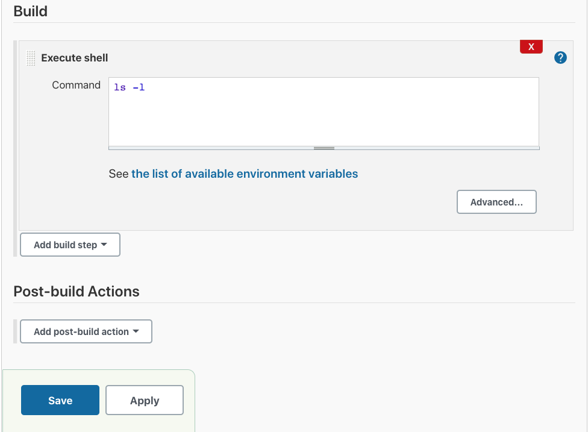

## 빌드 이후 배포 과정

이제 빌드 후의 작업을 설정하자. 먼저 젠킨스가 SSH서버(나의 경우에는 AWS EC2)를 인식하기 위한 설정이 필요하다. 이걸 위해 아까 publish over SSH 플러그인 을 설치한 것이다. 이제 사용하러 가자. Manage Jenkins의 Configure System으로 이동하자.

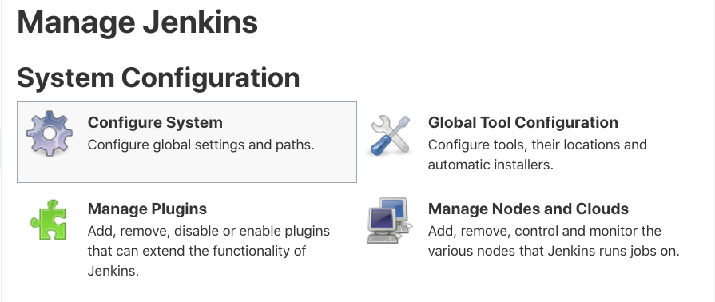

밑으로 주욱 내리다 보면 Publish over SSH 항목이 있다. Key부분에 AWS EC2에 사용되는 `.pem` 파일의 내용을 그대로 복사해서 넣으면 된다. 그 뒤 SSH Servers의 Add 버튼을 클릭하여 서버 접속 정보를 넣으면 된다.

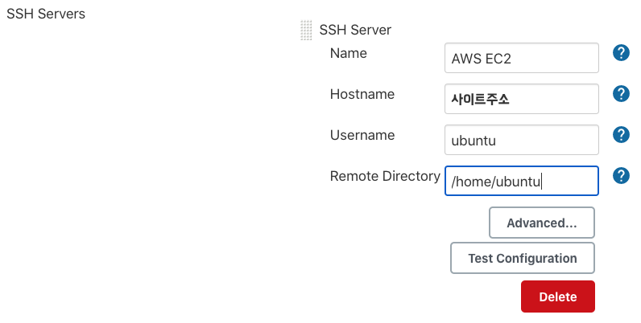

정보를 입력한 뒤 Test Configuration 버튼을 눌러 접속테스트를 해보자. 테스트 버튼 밑에  Success라는 메시지가 뜨면 성공한 것이므로 저장 버튼을 눌러서 빠져나온다. 저장버튼 안누르고 뒤로가기 누르면 안된다.

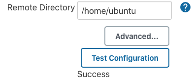

이제 다시 우리의 아이템 configure 탭으로 이동하여 Build스텝을 마저 정해야 한다. 조금 귀찮지만 다시 우리의 아이템의 configure 세션으로 이동하자. 이번엔 Send files or execute commands over SSH를 눌러서 추가적인 단계를 구성한다.

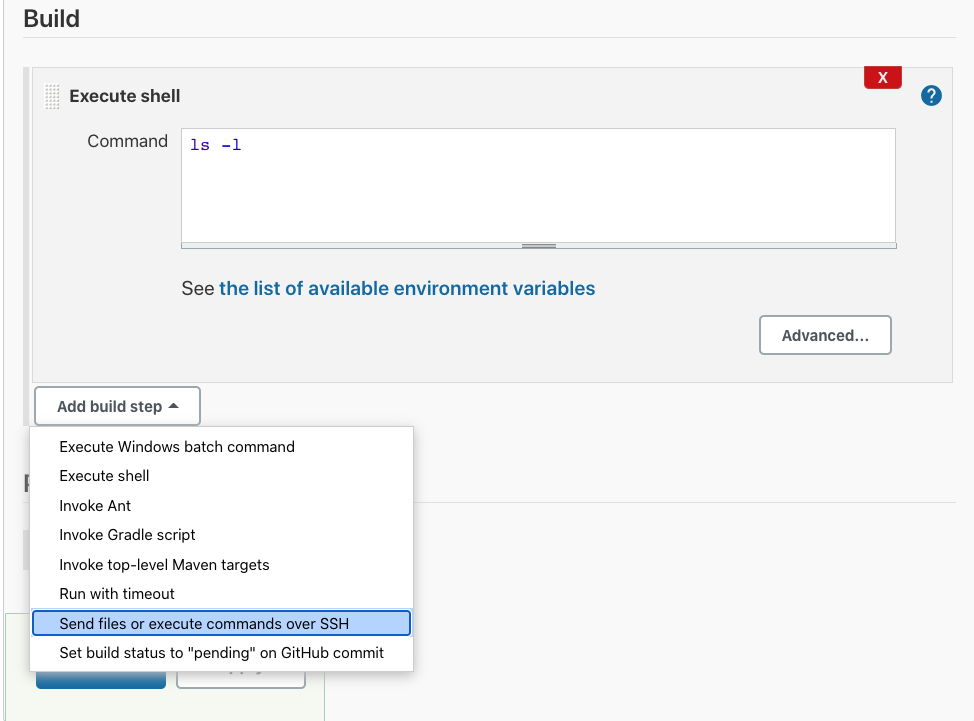

누르면 아까 우리가 설정했던 SSH 서버가 등장한다. 아까 Save버튼 안누르고 그냥 오면 이게 안보인다... 저장버튼이 이상하게 왼쪽하단에 고정된 방식으로 있는데 잘 적응하도록 하자. Exec command 에다가 빌드 명령 (ex: `npm run build`)를 입력해도 된다. 나는 우선 테스트를 위해 `docker ps` 를 써봤다. `*.*` 의 의미는 git clone 한 모든 파일들을 SSH 서버로 이동시키라는 뜻이고 `docker ps` 를 SSH 서버상에서 실행하고 마친다는 의미이다.

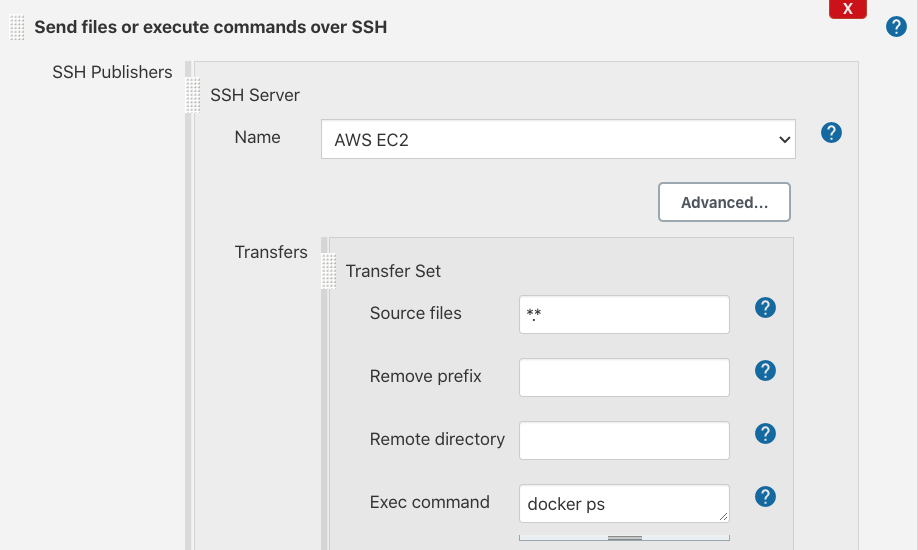

이제 완료되었다! 테스트를 위해 깃랩으로 돌아가서 아까 우리가 연결했던 웹훅에 있는 Test push events를 발동시켜보자.

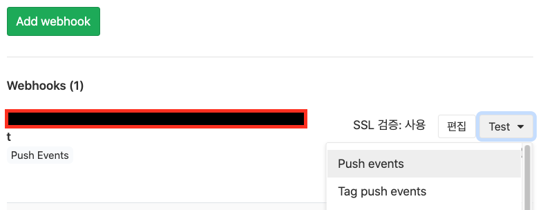

왼쪽 하단의 build history에 새로운 빌드가 실행되는 걸 볼 수 있다.

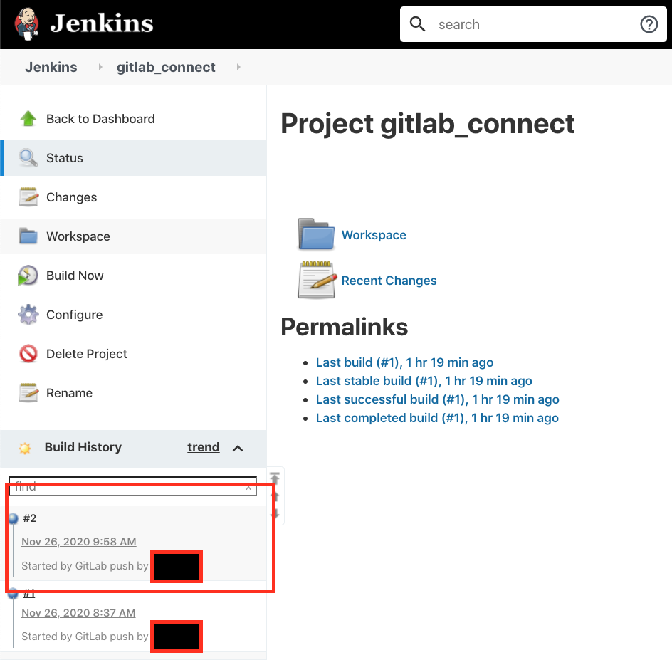

나는 제대로 명령어가 실행되는지 보기 위해 미리 SSH를 통해 우분투 서버에 접속해 있었다. 굳이 우분투 서버에 접속하지 않았더라도 해당 빌드를 눌러서 console output 에서도 확인 가능하니  제대로 실행되었는지 확인해보자

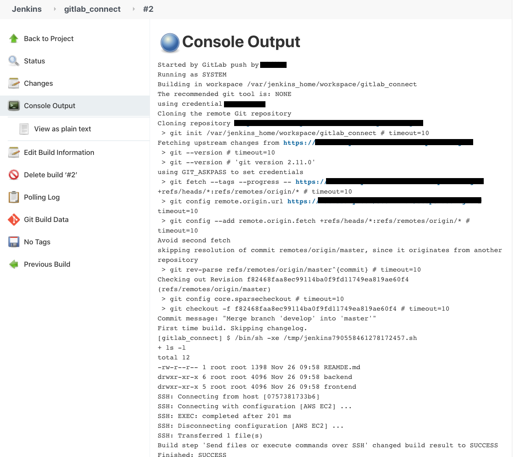

그럼 끝!