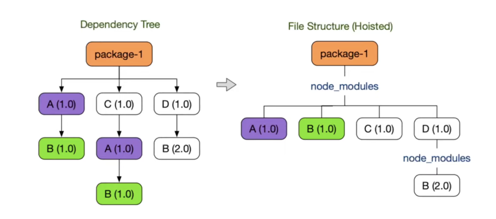
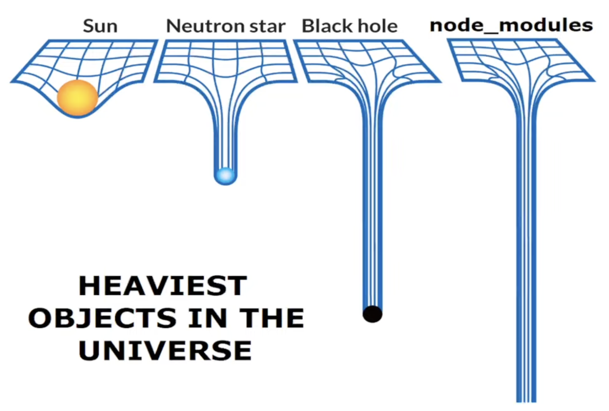
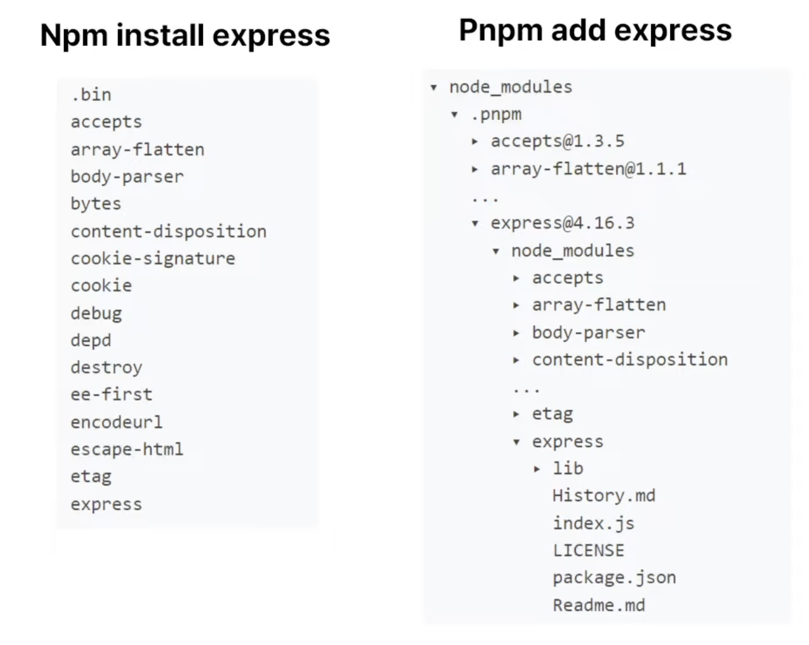
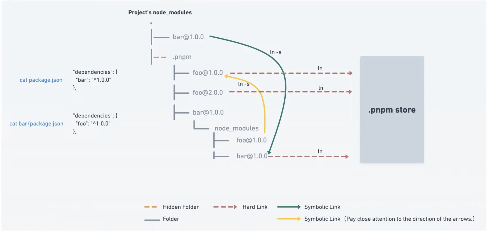
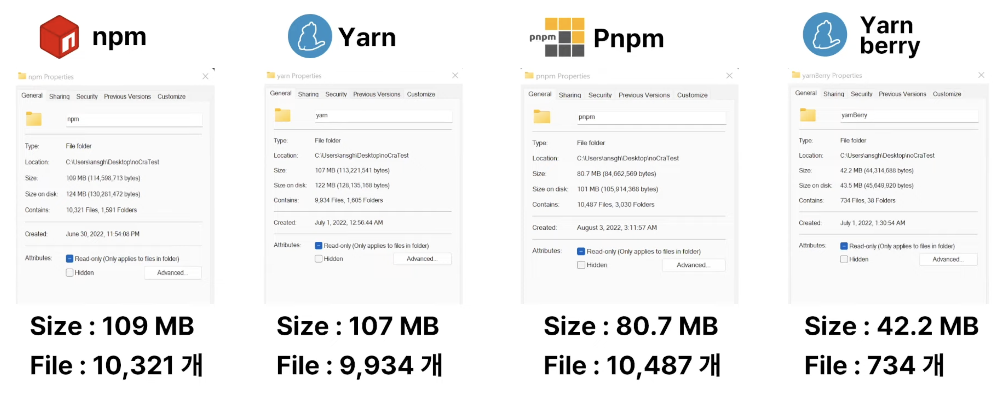
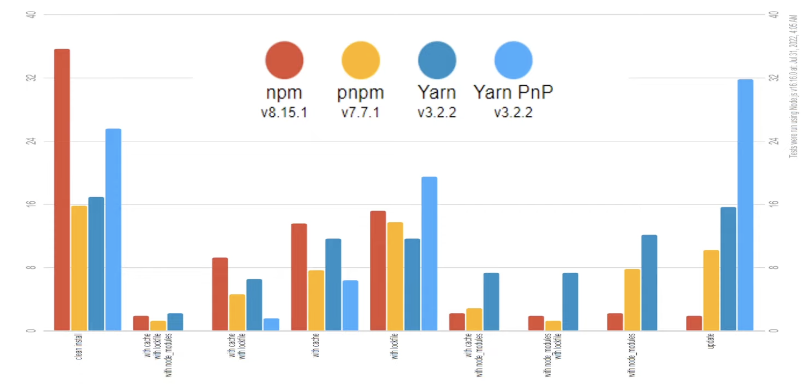

# package manager 고르기

출처: 유튜브-우테코
태그: npm

[[10분 테코톡] 비녀의 Package Manager](https://www.youtube.com/watch?v=Ds7EjE8Rhjs)

## 목차

- package manager란
- npm vs yarn
- pnpm & yarn berry
- 실제사례
- 결론

## package manager란

우리는 패키지를 import 해서 사용하는 데 익숙하다. 지금은 당연하게 require 나 import 로 가져온다. 초창기의 자바스크립트는 브라우저는 보조하는 도구로써 만들어졌기 때문에 코드량이 많지도 않았고, 모듈 형식의 임포트를 허락하지 않았다고 한다. 하지만 js 코드량이 많아지면서 모듈 형식의 임포트를 허용하게 되었다고 한다.

모듈은 하나의 레고 블럭이라고 생각할 수 있다.

패키지란 쉽게 말해서 이러한 모듈들을 뭉쳐놓은 하나의 집단이다. npm 에서는 좀 더 명확한 정의를 내리고 있는데, **모듈**이란 require 라는 노드의 도구를 사용해서 불러올 수 있는 것들을 모듈이라 부르고, package.json 을 가지고 있는 모듈 혹은 모듈의 뭉치를 **패키지** 라고 정의하고 있다.

### npm 의 등장

코드의 양이 점점 증가하면서 이런 패키지를 관리해야 할 필요성이 대두됨에 따라 2010년에 노드 개발자들이 npm 을 출시했다.

npm 은 네 가지 목적을 가지고 나왔다.

1. 여러 버전의 동일한 패키지를 한 프로젝트에서 사용할 수 있게 하자
2. 설치 방식을 통일하자
3. 패키지 관련 정보가 들어있는 메타데이터를 간소화하자
4. 누구나 배포할 수 있도록 하자

그래서 npm 을 사용하면 다음 구조가 기본이 된다.

```bash
node_modules/
.npmrc
package-lock.json
package.json
```

이 중 node_modules 와 package.json 은 앞으로 계속 등장하게 된다.

간단하게 설명하자면

- node_modules: 우리가 설치하고자 하는 패키지들이 담겨져 있음
- package.json: 패키지를 다룰 수 있는 cli 명령어 제공 및 패키지 메타데이터 제공

### yarn 의 등장

yarn(yet another resource negociator)은 2016년 페이스북 개발자들이 만들어 출시했다. yarn 은 npm 에서 개선하고자 하는 목표가 명확했다.

1. 병렬화를 통한 속도 개선
2. 자동화된 lock 생성
3. 의존성 트리 알고리즘 변경
4. 캐시 사용

npm 은 사실 병렬화를 허용하지 않았기 때문에 굉장히 느린 다운로드 속도를 가지고 있었다. 

또한 npm 이 지금은 락파일을 제공하지만 원래는 shrinkwrap 이라는 메서드를 사용해서 cli 명령어를 입력해야만 락파일을 생성했었다. 

의존성 트리 알고리즘의 경우, npm 에서는 패키지를 다운받는 순서에 따라 의존성이 조금씩 다를 수 있었는데, yarn은 다른 독자적 알고리즘을 선택함으로써 이 의존성 문제를  해결했다고 한다. 

캐시의 경우 yarn 은 캐시를 가지고 있어서 다운로드 받았던 패키지의 캐시를 가지고 있다고 한다. 이는 `.yarn/cache` 폴더가 존재하는 이유인데, 여기에 이미 다운로드 되어있는 패키지들을 저장함으로써 다시 다운로드 받는 일을 방지한다고 한다.

yarn 을 사용하는 경우의 폴더구조

```bash
.yarn/
	cache/
	releases/
		yarn-1.22.17.cjs
node_modules/
.yarnrc
package.json
yarn.lock
```

yarn 은 출시된 지 2년만에 노드 패키지 매니저 중 13퍼센트의 사용비중을 가질 정도로 높은 선호도를 보이고 있다. 

### npm 계열의 한계

1. 비효율적인 의존성 검색

노드에서 `require.resolve.paths('react');` 명령어를 사용해서 노드가 어떤 방식으로 패키지를 찾는지 알아볼 수 있다. 부모 디렉터리 부터 루트 디렉터리까지 패키지가 없다면 계속 찾아나가게 된다. 또한 상위 폴더로 올라가면서 폴더들을 전부 뒤지거나, 사용하지 말아야 할 node_modules 를 참조하여 버릴 수도 있다. 

1. 유령 의존성(호이스팅)
    
    
    

왼쪽 그림처럼 우리가 실제로 사용하는 패키지는 A, C, D 이다. 하지만 각 패키지가 가지고 있는 다른 패키지 의존성에 따라 다른 패키지들도 node_modules 에서는 끌어올려지게(호이스팅) 된다. 이 과정에서 B도 올라오게 된다. 

이러한 유령 의존성으로 생기는 문제는 1.node_modules에 존재하나 package.json에 명시되어 있지 않는 패키지가 생기고 2.A가 삭제가 된다면 B도 같이 삭제되어 버린다.

1. 너무 무거운 node_modules

그리고 node_modules 는 정말 정말 무겁다(프로젝트에서 node_modules 폴더를 삭제해보면 알 수 있다).  



실제로 npm 계열 패키지 매니저로 인스톨을 하는 경우 전체 설치 시간의 70퍼센트 정도를 node_modules 폴더를 구성하는데 쓰인다고 한다. 그렇기 때문에 패키지매니저는 다운로드만 우선 하고, 다운로드가 잘 되었는지에 대한 검사는 따로 하지 않는다. 실제로 네트워크 환경이 좋지 않은 경우 단순히 node_modules 재설치 만으로도 문제가 해결되는 경우가 가끔(…) 있다고 한다. 

이러한 문제를 해결하기 위해 새로운 세대의 패키지 매니저가 나오게 된다. 바로 pnpm 과 yarn berry 이다.

## pnpm

pnpm 은 npm 의 구조를 가져가나 한 가지만 다르다. 바로 평탄화되지 않은(플랫 하지 않은)  node_modules 를 사용하겠다는 것이다. 



이렇게만 보면 pnpm 이 더 비효율적이라고 볼 수 있으나 pnpm 은 이 구조적 비합리성(?)을 해결하기 위해 다른 알고리즘을 사용한다. 이 알고리즘의 핵심은 두가지인데 심링크(symbolic link)와 .pnpm store 파일이다. 



만약 우리가 두 개의 프로젝트를 가지고 있고, 각 프로젝트가 100개의 패키지에 대한 의존성이 있다고 치자. 기존의 npm 계열 패키지 매니저로는 두 개의 프로젝트에서 모든 패키지를 전부 인스톨한다.

하지만 pnpm 의 경우 루트 디렉토리에 .pnpm store라는 레지스트리를 자동으로 생성한다. 이 store 폴더를 두고 여기에 모든 의존성을 단 한번만 설치한다. 그리고 실제 프로젝트의 node_modules 에는 pnpm store 에 설치된 패키지의 심볼릭 링크만을 달아둔다.  이렇게 함으로써 메모리 공간낭비를 줄이고 중복되는 패키지의 재설치를 막는다. 또한 패키지가 다른 패키지에 의존성을 가지는 경우에도 마찬가지로 심볼릭 링크를 pnpm store 에 연결해두기 때문에 호이스팅이 일어나지 않아도 된다.

## yarn v2(yarn berry)

 yarn berry 는 pnpm 과는 조금 다르게 node_modules 라는 개념을 아예 없애버리려는 모습을 보여준다.

`yarn set version berry` 명령어로 사용이 가능하다.  yarn berry 의 목적은 다음과 같다.

> node_modules 와 node 에 내장된 의존성 관리 없이 의존성을 관리하면 어떨까?
> 

그래서 yarn berry 의 폴더구조는 node_modules 가 없고 .pnp.cjs 라는 다른 파일이 존재한다.

```bash
.yarn/
	cache/
	releases/
		yarn-3.1.1.cjs
	sdk/
	unplugged/
.pnp.cjs
.pnp.loader.mjs
.yarnrc.yml
package.json
yarn.lock
```

### cache

cache 폴더에 저장되는 것은 .zip 파일이다.  패키지를 zip 파일로 저장을 하는데 이렇게 하면 세가지 이점이 있다.

1. zero install(yarn install 불필요)
2. 오프라인 시 캐싱기능을 통해 사용 가능
3. ci 배포시에 clone 만 하면 의존성이 다 있기 떄문에 배포속도를 줄일 수 있다
4. 이외에도 폴더나 파일 개수가 줄어들고, 용량도 상당히 많이 줄어든다

이를 위해 yarn berry 에서는 plug and play 기능을 지원한다.

### plug N play

플러그-앤-플레이 의 경우 번역을 하자면 ‘플러그만 꽂으면 바로 작동하는’ 이라는 뜻이다. 토스터기를 생각해보자. 전원만 꼽고 스위치만 누르면 바로 사용이 가능하다. 어떻게 플러그-앤-플레이를 지원하는지는 pnp.cjs 파일을 보면 알 수 있다.

```json
["@types/react", [ // 어떤 패키지 인지
	[npm:18.0.14", { // 어떤 버전인지
		"pacpageLocation": "./.yarn/cache/@type-react-npm-18.0.14-asdf.zip/", // 어느 위치에 있는지
		"packageDependencies": [ // 어떤 의존성을 가지고 있는지
			["@types/react", "npm:18.0.14"],
			["@types/prop-types", "npm:15.7.5"],
			["@types/scheduler", "npm:0.16.2"],
			["csstype", "npm:3.1.0"],
		],
		"linkType": "HARD"
	}]
]]
```

pnp.cjs 파일은 쉽게 말하면 지도 이다. 어떤 패키지인지, 어떤 버전인지, 어디에 위치하며 어떤 의존성을 가지고 있는지 명시해준다. pnp.cjs 파일에 명시되어있는 명시된 패키지를 보면서 zip 파일들을 찾아서 사용하는 것이다. 

## 비교





 

캐시와 락파일을 둘 다 사용하는 경우 yarn berry 가 월등히 빠른 속도를 보여준다. 다른 경우 pnpm 이 조금 더 나은 사용성을 보여준다.