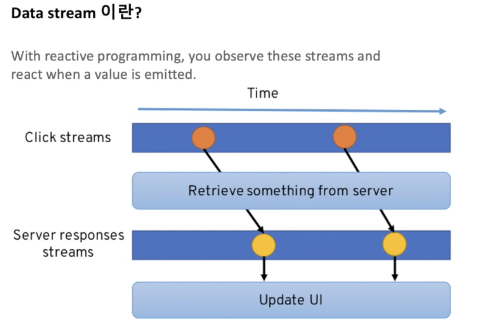

# Observable

옵저버블은 데이터스트림의 구현체

## 데이터 스트림이란?

시간의 흐름에 따라 데이터가 발생하는데, 시간에 따라 발생한 이벤트 스트림이 있다. 

## 옵저버블이란?

Data stream이라는 추상적인 개념을 구현한 구현체이다

옵저버블을 구독함으로써 그 옵저버블에서 다양한 값들이 발생하면 이를 받아서 어떤 행동을 취한다!

옵저버블이라는 말 그대로 '관측'이 가능하다. RxJS에서는 관측 보다는 '구독'이라는 단어로 설명을 하고 있다. 특정 옵저버블을 구독함으로써 해당 이벤트를 받아 본다.

이제 vscode로 넘어감