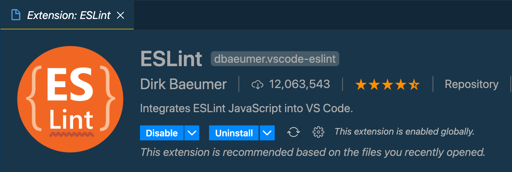
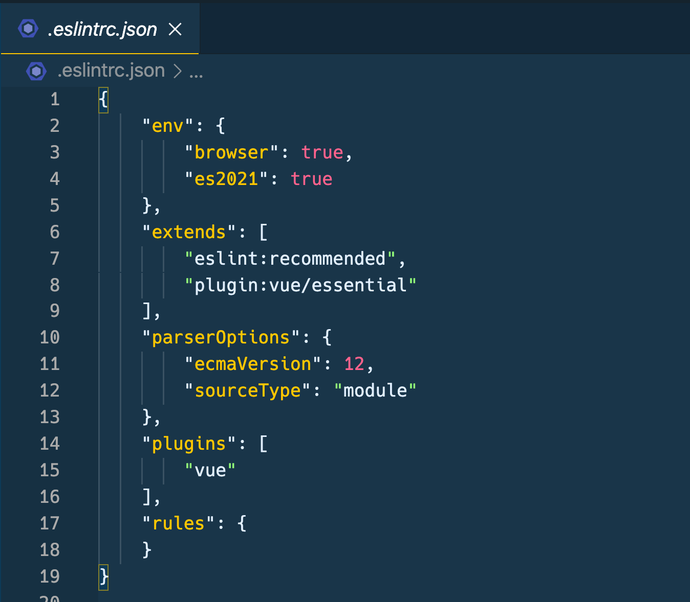

# VSCODE에 ESLint 설치

VS Code에 통합 ESLint를 설치한다. 이 익스텐션은 열려있는 워크스페이스 폴더에 ESLint를 적용해준다. 만일 폴더가 익스텐션이 가진 ESLint 라이브러리에 부합하지 않는다면 다른 글로벌 버전을 찾아준다. 만일 ESLint가 로컬이나 글로벌로 설치되어 있지 않다면 `npm install -g eslint` 를 통해 설치할 수 있다. 

새로운 폴더 안에는 `.eslintrc` 라는 설정파일을 만들어야 한다. VSCode 커맨드로 `create ESLint configuration`을 입력하거나 `eslint` 커맨드를 터미널에서 실행하면 된다. 

만일 글로벌한 ESLint를 설치했다면 `eslint --init` 을 터미널에서 실행하면 된다. 

지역적으로(locally) 설치했다면 `./node_modules/.bin/esling --init` 을 통해 실행하면 된다.



리팩토링을 하려는 프로젝트 폴더를 열고 커맨드를 실행했다

```bash
$ npm install -g eslint
/usr/local/bin/eslint -> /usr/local/lib/node_modules/eslint/bin/eslint.js
+ eslint@7.15.0
added 109 packages from 64 contributors in 3.087s

$ eslint --init
✔ How would you like to use ESLint? · problems
✔ What type of modules does your project use? · esm
✔ Which framework does your project use? · vue
✔ Does your project use TypeScript? · No / Yes
✔ Where does your code run? · browser
✔ What format do you want your config file to be in? · JSON
The config that you've selected requires the following dependencies:
...

eslint-plugin-vue@latest
✔ Would you like to install them now with npm? · No / Yes
Installing eslint-plugin-vue@latest
```

몇가지 설정을 해 주고 나면 .eslintrc.json 파일이 생성된 것을 볼 수 있다.

